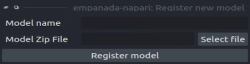
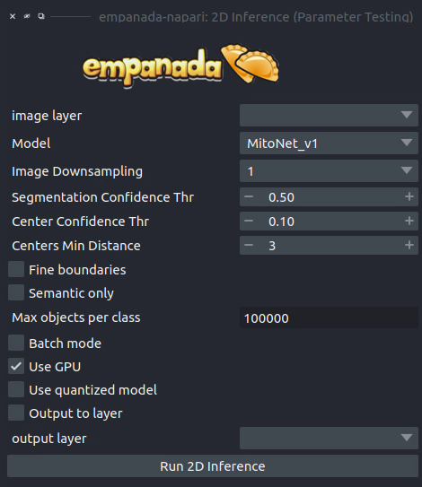
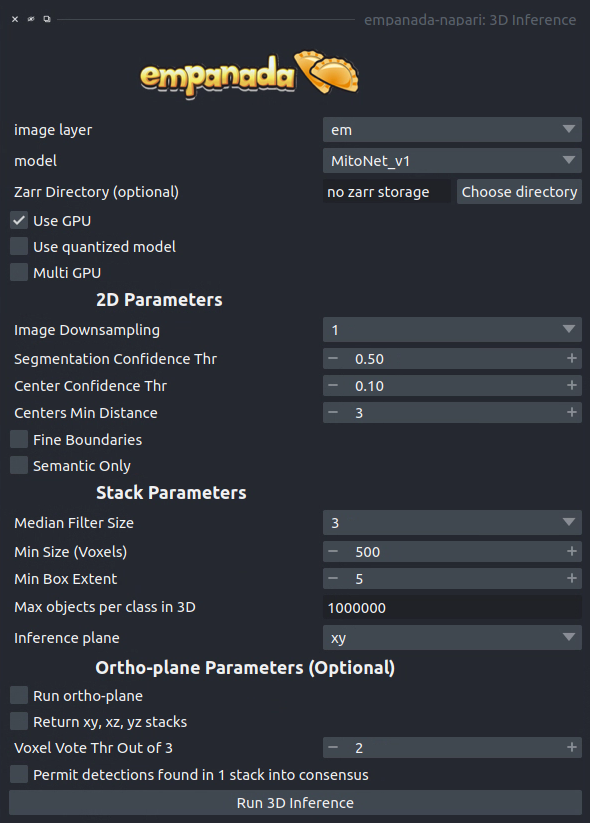
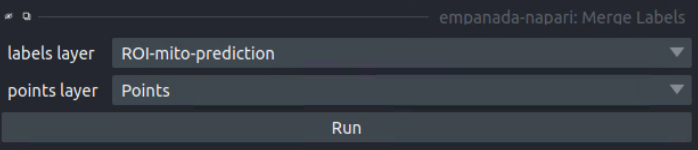
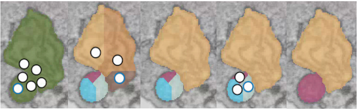

empanada-napari
-----------------

Models trained in empanada can be exported for use in Napari. To get started, install conda and napari
following the official `napari installation instructions <https://napari.org/tutorials/fundamentals/installation>`_.

Installation
==============

After confirming that napari runs, the easiest way to install empanada-napari is directly in napari.

1. From the “Plugins” menu, select “Install/Uninstall Plugins...”.

.. image:: _static/plugin-menu.png
  :align: center
  :width: 200px
  :alt: Napari Plugin menu

2. In the resulting window that opens, where it says “Install by name/URL”, type "empanada-napari".

.. image:: _static/plugin-install-dialog.png
  :align: center
  :width: 500px
  :alt: Plugin installation dialog

3. Click the “Install” button next to the input bar.

Alternatively, the plugin can be installed with pip::

	$ pip install empanada-napari

Modules Overview
===================

There are three modules related to automatic segmentation and three for manual cleanup.
For segmentation there are:

  1. Register new model
    * Import a model that was exported from empanada.
    * All model files are stored in a special directory `~/.empanada`

  2. 2D Inference (Parameter Testing)
    * Runs model inference on 2D EM images
    * Runs model inference on an arbitrary 2D slice of a 3D dataset. Works for xy, xz and yz planes

  3. 3D Inference
    * Implements stack and ortho-plane inference functionality

Manual cleanup modules are:

  1. Merge labels
    * Allows the selection of multiple instances and merges them all to the same label

  2. Split labels
    * Allows the placement of multiple markers for watershed-based instance splitting.

  3. Delete labels
    * Allows the removal of selected labels.

Register new model
====================

Parameters
^^^^^^^^^^^^^^^^

**Model name:** User chosen name to use for this model throughout the other plugin modules.

**Model Zip File:** Zip file containing the output of a model export from empanada (see Export tutorial).
Note that current only Point Rend enabled models can be imported.

Note that if the 2D or 3D Inference module have already been opened then imported models will not
appear in the available models list. Restarting napari with update it. Currently deleting
models is manual. Delete the config file from `~/.empanada/configs` and delete the four model files
from `~/.empanada/models`. Model file names are `{model_name}_render_cpu.pth`, `{model_name}_render_gpu.pth`,
`{model_name}_base_cpu.pth` and `{model_name}_base_gpu.pth`.

2D Inference (Parameter Testing)
==================================

Parameters
^^^^^^^^^^^^^

**image layer:** The napari image layer on which to run model inference.

**Model:** Model to use for inference.

**Image Downsampling:** Downsampling factor to apply to the input image before running
model inference. The returned segmentation will be interpolated to the original
image size using the Point Rend module.

**Segmentation Confidence Thr:** The minimum confidence required for a pixel to
be classified as foreground. This only applies for binary segmentation.

**Center Confidence Thr:** The minimum intensity of a peak in the centers heatmap
for it to be considered a true object center.

**Centers Min Distance:** The minimum distance allowed between centers in pixels.

**Fine boundaries:** Whether to run Panoptic DeepLab postprocessing at 0.25x the
input image resolution.

**Semantic Only:** Whether to skip panoptic postprocessing and return only a semantic
segmentation.

**Max objects per class:** The maximum number of objects that are allowed for any one
of the classes being segmented by the model.

**Use GPU:** Whether to use system GPU for running inference. If no GPU is detected
on the workstation, then this parameter is ignored.

See **Segmentation Best Practices** section below for detailed usage notes.

3D Inference
==================================

General Parameters
^^^^^^^^^^^^^^^^^^^^^^

**image layer:** The napari image layer on which to run model inference.

**model:** Model to use for inference.

**Zarr Directory (optional):** Path at which to store segmentation results in zarr
format. Writing results to disk can help avoid out-of-memory issues when running
inference on large volumes. Napari natively supports reading zarr files.

**Use GPU:** Whether to use system GPU for running inference. The box will be
check by default if a GPU is found on your system. If no GPU is detected, then
this parameter is ignored.

**Multi GPU:** If the workstation is equipped with more than 1 GPU, inference
can be distributed across them. This feature is considered experimental and may
break.

2D Parameters
^^^^^^^^^^^^^^^^

**Image Downsampling:** Downsampling factor to apply to the input image before running
model inference. The returned segmentation will be interpolated to the original
image size using the Point Rend module.

**Segmentation Confidence Thr:** The minimum confidence required for a pixel to
be classified as foreground. This only applies for binary segmentation.

**Center Confidence Thr:** The minimum intensity of a peak in the centers heatmap
for it to be considered a true object center.

**Centers Min Distance:** The minimum distance allowed between centers in pixels.

**Fine boundaries:** Whether to run Panoptic DeepLab postprocessing at 0.25x the
input image resolution.

**Semantic Only:** Whether to skip panoptic postprocessing and return only a semantic
segmentation.

Stack Parameters
^^^^^^^^^^^^^^^^^^^

**Median Filter Size:** Number of image slices over which to apply a median filter
to semantic segmentation probabilities.

**Min Size (Voxels):** The smallest size object that's allowed in the final
segmentation as measured in voxels.

**Min Box Extent:** The minimum bounding box dimension that's allowed for an
object in the final segmentation. (Filters out big "pancakes").

**Max objects per class:** The maximum number of objects that are allowed for any one
of the classes being segmented by the model within a single 3D stack.

Ortho-plane Parameters (Optional)
^^^^^^^^^^^^^^^^^^^^^^^^^^^^^^^^^^^^

**Run ortho-plane:** Whether to run ortho-plane inference. If unchecked, inference
will only be run on slices from the xy plane.

**Return xy, xz, yz stacks:** Whether to return the panoptic segmentation stacks created
during inference on each plane. If unchecked, only the per-class consensus volumes
will be returned.

**Voxel Vote Thr Out of 3:** Number of stacks from ortho-plane inference in which a voxel
must be labeled in order to end up in the consensus segmentation.

**Permit detections found in 1 stack into consensus:** Whether to allow objects
that appear in only a single stack (for example an object only segmented in xy)
through to the ortho-plane consensus segmentation.

Segmentation Best Practices
============================

Depending on the size of the volume, 3D inference can take some time even with a GPU,
therefore it's highly recommended to test out inference parameters beforehand using the
2D inference module. The 2D inference module will run inference on whatever image slice
the viewer is pointed at in napari. This means that parameters can be tested on xy, xz and yz
slices beforehand by flipping the volume and scrolling through the images.

**Note:** When running the 2D inference module on images of a given size for the first
time, results can be slow. After inference is run twice on a particular size it will
be much faster. This is because pytorch is performing optimization in the background to
make the model faster on your systems hardware.

We've found that models can give considerably different results based on the nanometer
resolution of the input image. Also, model inference is faster the smaller the input image,
so ideally you'd want to find and use the biggest **Image Downsampling** factor that still gives
satisfactory results.

Tweaking the **Segmentation Confidence Threshold** is often just a proxy for erosion and dilation of labels.
Because ortho-plane inference averages segmentations from 3 views, using a lower confidence
threshold is sometimes beneficial. Overall, 0.3 seems to be a little better than 0.5 in that
context.

The **Center Confidence Thr** and **Centers Min Distance** parameters both control how split up
instances will be in 2D. Raising the confidence threshold will result in fewer object centers
and therefore fewer instances in the segmentation. Similarly, increasing the minimum distance
will filter out centers that are too close together; this can help especially when you notice
that long objects are being oversplit into little fragments.

Lastly for 2D parameters, the **Fine boundaries** option may be useful if the borders between instances
are too "blocky". This comes at the cost of 4x more GPU memory usage though, so use it wisely.

The most important 3D parameter is the **Median Filter Size**. This helps to smooth out stacked
segmentations. The best kernel size is usually determined the by resolution of the voxels. Lower-resolution
voxel (>20 nm) that have relatively more change between consecutive slices usually benefit from a smaller
kernel size like 3. Higher-resolution volumes (<10 nm) have much less change across slices and a kernel
size of 7 or 9 can work well.

Setting the **Min Size** and **Min Extent** is a function of how large objects are expected
to be in the volume: this depends on both biology and the voxel resolution. As a rough estimate,
try drawing a bounding box around a small object that you see. Divide the volume of the box by 2
to get the approximate volume of a sphere that would fit inside that box. Pick some number a few
hundred voxels below that threshold as your min size.

The **Voxel Vote Thr Out of 3** and **Permit detections found in 1 stack into consensus** are options
for when there are too many false negatives after ortho-plane segmentation. Decreasing the voxel
vote threshold to 1 will fill in more voxels but should not increase the number of false positive detections
very much. This is because the voxel vote threshold only affects detections that were picked up in more than 1 of the
inference stacks. Allow minority clusters, on the other hand, can increase false positives because
it will allow detections picked up by just a single view into the consensus segmentation.

Final note. When running ortho-plane inference it's recommended to also **Return xy, xz, yz stacks**
segmentations. In some cases, inference results are better on just a single plane (i.e., xz)
than they are in the consensus. Returning the intermediate panoptic results for each stack
will help you to decide whether that applies to your dataset or not.

Split, Merge, Delete Labels
=============================

These modules are used for manual cleanup of the predicted segmentation, especially
for fixing oversplit and overmerged instances. Importantly, they were inspired
by this `nifty plugin <https://github.com/haesleinhuepf/napari-manual-split-and-merge-labels>`_.
Unlike that plugin, these functions work for both 2D and 3D images. **Currently,
label layers must be of numpy type. If the segmentations were stored in
zarr format then they will have to be converted first.**

The interface for Split, Merge and Delete modules are all the same:

Parameters
^^^^^^^^^^^^^^^^

**labels layer:** The napari labels layer for which to apply operations.

**points layers:** The napari points layer used for select points/instances.

Here's example usage for split and merging objects.

    Left to right: (a) Points are placed on a overmerged instance. Each point is a marker for
    watershed. (b) Applying split separates the instance into six fragments. Points are
    placed to specify fragments for merging. (c) The fragments in the top instance are merged.
    (d) Points are placed for fragments to merge in the bottom instance. (e) The bottom
    instance is merged.

For the delete module a point is placed over the object to be deleted. That object is then
removed entirely from the segmentation.
