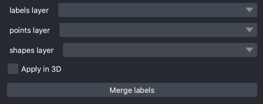
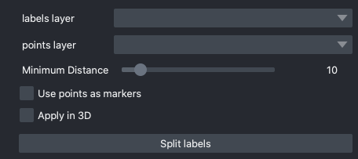

empanada-napari
******************

.. image:: _static/demo.gif
    :width: 1000px
    :align: center
    :alt: 2D inference demo

Installation
==============

Napari is still considered alpha phase software and may not install correctly on the
first attempt, if that happens please open an issue `with us here <https://github.com/volume-em/empanada-napari/issues>`_.
Or reach out to the napari developers directly `here <https://github.com/napari/napari/issues>`_.

.. note::

  **Only Python 3.7, 3.8, 3.9 are supported, 3.10 and later are not.**

1. If not already installed, you can `install miniconda here <https://docs.conda.io/en/latest/miniconda.html>`_.

2. Download the correct installer for your OS (Mac, Linux, Windows).

3. After installing `conda`, open a new terminal or command prompt window.

4. Verify conda installed correctly with::

    $ conda --help

  .. note::
      If you get a "conda not found error" the most likely cause is that the path wasn't updated correctly. Try restarting
      the terminal or command prompt window. If that doesn't work then
      see `fixing conda path on Mac/Linux <https://stackoverflow.com/questions/35246386/conda-command-not-found>`_
      or `fixing conda path on Windows <https://stackoverflow.com/questions/44597662/conda-command-is-not-recognized-on-windows-10>`_.

5. If you've previously installed and used conda, it's recommended (but optional) to create a new virtual environment in order to avoid dependency conflicts::

    $ conda create -y -n empanada -c conda-forge python=3.9
    $ conda activate empanada

6. Install napari with pip::

    $ python -m pip install "napari[all]"

7. To verify installation, run::

    $ napari

For alternative and more detailed installation instructions, see the
`official napari installation tutorial <https://napari.org/tutorials/fundamentals/installation>`_.

From here the easiest way to install empanada-napari is directly in napari.

1. From the “Plugins” menu, select “Install/Uninstall Plugins...”.

.. image:: _static/plugin-menu.png
  :align: center
  :width: 200px
  :alt: Napari Plugin menu

2. In the resulting window that opens, where it says “Install by name/URL”, type "empanada-napari".

.. image:: _static/plugin-install-dialog.png
  :align: center
  :width: 500px
  :alt: Plugin installation dialog

3. Click the “Install” button next to the input bar.

If installation was successful you should see empanada-napari in the Plugins menu. If you don't, restart napari.

If you still don't see it, try installing the plugin with pip::

	$ pip install empanada-napari

Modules Overview
===================

Model Inference
^^^^^^^^^^^^^^^^^

`2D Inference (Parameter Testing)`_: Runs model inference on 2D images. Supports batch mode for
predicting segmentations on a series of unrelated images or can be used to segment arbitrary 2D slices
from volumetric data.

`3D Inference`_: Implements stack and ortho-plane inference functionality for volumetric datasets.

Model Training
^^^^^^^^^^^^^^^^^

`Pick training patches`_: Automatically picks patches of data to annotate from 2D or
3D images. Also gives the option for uses for manually select ROIs using placed points.

`Store training dataset`_: Stores training patch segmentations in the correct format
expected for model finetuning and training.

`Finetune a model`_: Allows users to finetune any registered model on a specialized
segmentation dataset.

`Train a model`_: Train models from scratch for arbitrary panoptic segmentation tasks.
Optionally, initialize training from CEM pre-trained weights for faster convergence
and greater robustness.

`Register new model`_: Make a new model accessible in all other training and inference
modules. Models can be registered from .pth files or from web URLs. Useful for
sharing models locally or over the internet.

`Get model info`_: Get information about registered models to help decide which one
is appropriate for inference or finetuning. 

Proofreading Tools
^^^^^^^^^^^^^^^^^^^^

`Merge and Delete labels`_: Allows the selection of multiple instances and merges them all to
the same label and allows the removal of selected labels, respectively.

`Split labels`_: Allows the placement of multiple markers for distance watershed-based instance splitting.

`Jump to label`_: Given a label ID, moves the napari viewer to the first 2D slice where an object appears.

2D Inference (Parameter Testing)
==================================

.. image:: _static/inference_2d.png
  :align: center
  :width: 500px
  :alt: Dialog for the 2D inference and parameter testing module.

Results
^^^^^^^^^^^^^

Returns a 2D labels layer in the napari viewer.

Parameters
^^^^^^^^^^^^^

**image layer:** The napari image layer on which to run model inference.

**Model:** Model to use for inference.

**Image Downsampling:** Downsampling factor to apply to the input image before running
model inference. The returned segmentation will be interpolated to the original
image size using the Point Rend module.

**Segmentation Confidence Thr:** The minimum confidence required for a pixel to
be classified as foreground. This only applies for binary segmentation.

**Center Confidence Thr:** The minimum intensity of a peak in the centers heatmap
for it to be considered a true object center.

**Centers Min Distance:** The minimum distance allowed between centers in pixels.

**Fine boundaries:** Whether to run Panoptic DeepLab postprocessing at 0.25x the
input image resolution. Can correct some segmentation errors at the cost of 4x
more GPU/CPU memory during postprocessing.

**Semantic Only:** Whether to skip panoptic postprocessing and return only a semantic
segmentation.

**Max objects per class:** The maximum number of objects that are allowed for any one
of the classes being segmented by the model.

**Batch Mode:** If checked, the selected model will be run independently on each
xy slice in a stack of images. This can be used, for example, to run inference on
all images in a folder by loading them with the "Open Folder..." option.

**Use GPU:** Whether to use system GPU for running inference. If no GPU is detected
on the workstation, then this parameter is ignored.

**Use quantized model:** Whether to use a quantized version of the segmentation model.
The quantized model only runs on CPU but uses ~4x less memory and runs 20-50% faster (depending
on the model architecture). Results may be 1-2% worse than using the non-quantized version.

**Output to layer:** If checked, the output of the model will be inserted into the given
output layer (next argument). This argument is incompatible with Batch mode and will raise
an error if both are checked.

**output layer:** If Output to layer is checked, the output of the model will be inserted
into this layer, otherwise a new layer will be created. The output layer must be the same
shape as the image layer.

See `Inference Best Practices`_ below for more usage notes.

3D Inference
==================================

.. image:: _static/inference_3d.png
  :align: center
  :width: 500px
  :alt: Dialog for the 3D inference module.

Results
^^^^^^^^^^^^^

Returns a 3D labels layer in the napari viewer for each segmentation class and,
optionally, panoptic segmentation stacks.

General Parameters
^^^^^^^^^^^^^^^^^^^^^^

**image layer:** The napari image layer on which to run model inference.

**model:** Model to use for inference.

**Zarr Directory (optional):** Path at which to store segmentation results in zarr
format. Writing results to disk can help avoid out-of-memory issues when running
inference on large volumes. Napari natively supports reading zarr files.

**Use GPU:** Whether to use system GPU for running inference. The box will be
check by default if a GPU is found on your system. If no GPU is detected, then
this parameter is ignored.

**Use quantized model:** Whether to use a quantized version of the segmentation model.
The quantized model only runs on CPU but uses ~4x less memory and runs 20-50% faster (depending
on the model architecture). Results may be 1-2% worse than using the non-quantized version.

**Multi GPU:** If the workstation is equipped with more than 1 GPU, inference
can be distributed across them. See note in `Inference Best Practices`_.

2D Parameters
^^^^^^^^^^^^^^^^

**Image Downsampling:** Downsampling factor to apply to the input image before running
model inference. The returned segmentation will be interpolated to the original
image size using the Point Rend module.

**Segmentation Confidence Thr:** The minimum confidence required for a pixel to
be classified as foreground. This only applies for binary segmentation.

**Center Confidence Thr:** The minimum intensity of a peak in the centers heatmap
for it to be considered a true object center.

**Centers Min Distance:** The minimum distance allowed between centers in pixels.

**Fine boundaries:** Whether to run Panoptic DeepLab postprocessing at 0.25x the
input image resolution. Can correct some segmentation errors at the cost of 4x
more GPU/CPU memory.

**Semantic Only:** Whether to skip panoptic postprocessing and return only a semantic
segmentation.

Stack Parameters
^^^^^^^^^^^^^^^^^^^

**Median Filter Size:** Number of image slices over which to apply a median filter
to semantic segmentation probabilities.

**Min Size (Voxels):** The smallest size object that's allowed in the final
segmentation as measured in voxels.

**Min Box Extent:** The minimum bounding box dimension that's allowed for an
object in the final segmentation. (Filters out big "pancakes").

**Max objects per class in 3D:** The maximum number of objects that are allowed for any one
of the classes being segmented by the model within a volume.

**Inference plane:** Plane from which to extract and segmentat slices. Choice of xy, xz, or yz.

Ortho-plane Parameters (Optional)
^^^^^^^^^^^^^^^^^^^^^^^^^^^^^^^^^^^^

**Run ortho-plane:** Whether to run ortho-plane inference. If unchecked, inference
will only be run on slices from the Inference plane chosen above.

**Return xy, xz, yz stacks:** Whether to return the panoptic segmentation stacks created
during inference on each plane. If unchecked, only the per-class consensus volumes
will be returned.

**Voxel Vote Thr Out of 3:** Number of stacks from ortho-plane inference in which a voxel
must be labeled in order to end up in the consensus segmentation.

**Permit detections found in 1 stack into consensus:** Whether to allow objects
that appear in only a single stack (for example an object only segmented in xy)
through to the ortho-plane consensus segmentation.

Inference Best Practices
============================

Depending on the size of the volume, 3D inference can take some time even with a GPU,
therefore it's highly recommended to test out inference parameters beforehand using the
2D inference module. The 2D inference module will run inference on whatever image slice
the viewer is pointed at in napari. This means that parameters can be tested on xy, xz and yz
slices by flipping the volume and scrolling through the stack. If results appear substantially
better on slices from a particular plane, then use that plane as the **Inference plane** for
3D inference. Similarly, if results on xy slices are good but results on xz and yz slices are poor,
then don't use ortho-plane inference.

.. note::

  When running the 2D inference module on images of a given size for the first
  time, results can be slow. After inference is run twice on a particular size it will
  be much faster. This is because pytorch is performing optimization in the background to
  make the model faster on your systems hardware.

.. note::

  When using Multi-GPU inference there's some overhead associated with the
  creation of a process group. This overhead can make Multi-GPU inference slower
  on small volumes. Therefore, we don't recommend using it unless working with datasets
  larger than 1 GB. However, in such cases, the inference speed-up is nearly linear
  (segmentation will be 4x faster with 4 GPUs than with 1). As more GPUs are added,
  inference starts to become CPU bound (i.e., the segmentations are being created
  faster on GPU than they can be processed on CPU). There can be a long delay between
  inference and backward matching as the CPU processes work to catch up.

We've found that models can give considerably different results based on the nanometer
resolution of the input image and model inference is faster for smaller input images.
Ideally you'll want to find and use the biggest **Image Downsampling** factor that still gives
satisfactory results.

Tweaking the **Segmentation Confidence Threshold** is often just a proxy for erosion and dilation of labels.
Because ortho-plane inference averages segmentations from 3 views using a lower confidence
threshold is sometimes beneficial: try 0.3 instead of 0.5.

The **Center Confidence Thr** and **Centers Min Distance** parameters both control how split up
instances will be in 2D. Raising the confidence threshold will result in fewer object centers
and therefore fewer instances in the segmentation. Increasing the minimum distance
will filter out centers that are too close together. This can help if you notice
that long objects are being oversplit.

Lastly for 2D parameters, the **Fine boundaries** option may be useful if the borders between instances
are too "blocky". This comes at the cost of 4x more memory usage during postprocessing though, so use it wisely.

The most important 3D parameter is the **Median Filter Size**. This smooths out the stacked
segmentations. The best kernel size is typically a function of voxel size. Lower-resolution
volumes (>20 nm) that have relatively more change between consecutive slices usually benefit from a smaller
kernel size like 3. Higher-resolution volumes (<10 nm) have much less change across slices and a kernel
size of 7 or 9 can work well.

The **Min Size** and **Min Extent** parameters filter out small objects and segmentation "pancakes". The
optimal size is strongly data-dependent. As a rough estimate, try drawing a bounding box around a small
object that you see. Divide the volume of the box by 2 to get the approximate volume of a sphere that
would fit inside that box. Pick some number a few hundred voxels below that threshold as your min size.
Likewise, the min extent should be a few increments less than the smallest dimension of the bounding box.

The **Voxel Vote Thr Out of 3** and **Permit detections found in 1 stack into consensus** are options
for when there are too many false negatives after ortho-plane segmentation. Decreasing the voxel
vote threshold to 1 will fill in more voxels but should not increase the number of false positive detections
very much. This is because the voxel vote threshold only affects detections that were picked up in more than 1 of the
inference stacks. **Permit detections found in 1 stack into consensus**, on the other hand, can increase false positives because
it will allow detections picked up by just a single stack into the consensus segmentation (what a well named parameter!).

When running ortho-plane inference it's recommended to also **Return xy, xz, yz stacks**
segmentations. In some cases, inference results are better on just a single plane (i.e., xz)
than they are in the consensus. Returning the intermediate panoptic results for each stack
will help you to decide whether that applies to your dataset or not.

Pick training patches
==================================

.. image:: _static/pick_patches.png
  :align: center
  :width: 500px
  :alt: Dialog for the patch picking module.

Results
^^^^^^^^^^^^^

If the image to pick patches from is 3D, returns a set of flipbooks with five
images in each along with a corresponding labels layer of the same size. If the
image is instead 2D or a 2D stack, returns a set of patches and a labels layer
of matching size.

.. note::

  When flipbooks are returned, it's assumed that the middle image in each will
  be annotated. For example, in a flipbook with five images, only the third image
  should be segmented.

Parameters
^^^^^^^^^^^^^

**image layer:** The napari image layer from which to sample patches.

**points layer:** Optional. The napari points layer containing fiducial points
centered at ROIs to pick for annotation.

**Number of patches for annotation:** Number of patches to pick for annotation.
By default, patches are chosen randomly. If the points layer was given but has
fewer points than this number, the remainder will be made up with random patches.
Overwritten if **Pick all points** (below) is selected.

**Patch size in pixels:** The desired pixel size for chosen patches. All patches
are square.

**Multiscale image level:** If the image layer is a multiscale image, select the
resolution level from which to sample. It's assumed that images in each level
were downsampled by 2x.

**Pick all points:** If checked, patches will be created from all points in
the given points layer, regardless of the **Number of patches for annotation**
that was set.

**Pick from xy, xz, or yz:** If checked, patches will be arbitrarily selected from
any of the principle planes. Only select this option for nearly isotropic voxel
3D datasets.

**Image is 2D stack:** If checked, treats the image layer as a stack of unrelated
2D images. For example, check this box when picking patches from a directory
of 2D images that were loaded with the "Open Folder..." option.

Store training dataset
==================================

.. image:: _static/store_training_dataset.png
  :align: center
  :width: 500px
  :alt: Dialog for the dataset saving module.

Results
^^^^^^^^^^^^^

Creates or appends data to a directory with the structure expected for
model finetuning and training. If the image and labels layers are
flipbooks, only the middle image in each flipbook is saved.

Parameters
^^^^^^^^^^^^^

**image layer:** The napari image layer for annotated patches or flipbooks.

**labels layer:** The napari labels layer for annotated patches or flipbooks.

**Save directory:** Directory in which to save the dataset. A subdirectory
with the given **Dataset name** (below) will be created.

**Dataset name:** Name of the dataset directory to create. If the dataset already
exists, the new data will be appended.

Finetune a model
==================================

.. image:: _static/finetune_model.png
  :align: center
  :width: 500px
  :alt: Dialog for the model finetuning module.

Results
^^^^^^^^^^^^^

Saves and registers a .pth torchscript model that has been finetuned on
the provided data. Also saves a .yaml config with parameters necessary for
additional finetuning.

Parameters
^^^^^^^^^^^^^

**Model name, no spaces:** Name of the finetuned model as it will appear in the
other empanada modules after finetuning.

**Train directory:** Training directory for finetuning. Must conform to the
standard directory structure specified for empanada (as for example is created
by the `Store training dataset`_ module).

**Validation directory (optional):** Validation directory. Must conform to the
standard directory structure specified for empanada. Can be the same as **Train directory**.

**Model directory:** Directory in which to save the finetuned model definition
and config file. The directory will be created if it doesn't exist already.

**Model to finetune:** Empanada model to finetune.

**Finetunable layers:** Layers to unfreeze in the model encoder during
finetuning.

**Iterations:** Number of iterations to finetune the model.

**Patch size in pixels:** Patch size in pixels to use for random cropping of the image during finetuning.
Should be divisible by 16 for PanopticDeepLab model or 128 for PanopticBiFPN models. Use `Get model info`_ to
check.

**Custom config (optional):** Use a custom config file to set other training
hyperparameters. `See here for a template to modify <https://github.com/volume-em/empanada-napari/blob/train/custom_configs/custom_finetuning.yaml>`_.

Train a model
==================================

.. image:: _static/train_model.png
  :align: center
  :width: 500px
  :alt: Dialog for the model training module.

Results
^^^^^^^^^^^^^

Saves and registers a .pth torchscript model that has been trained on
the provided data. Also saves a .yaml config with parameters necessary for
additional finetuning.

Parameters
^^^^^^^^^^^^^

**Model name, no spaces:** Name of the model as it will appear in the
other empanada modules after training.

**Train directory:** Training directory for finetuning. Must conform to the
standard directory structure specified for empanada (as for example is created
by the `Store training dataset`_ module).

**Validation directory (optional):** Validation directory. Must conform to the
standard directory structure specified for empanada. Can be the same as **Train directory**.

**Model directory:** Directory in which to save the trained model definition,
weights, and config file. The directory will be created if it doesn't exist already.

**Dataset labels:** List of labels in the training dataset. Each line is a comma separated list of three
items without spaces: <class_id>,<class_name>,<class_type>. Class IDs must be integers, class names
can be anything, class types must be either 'semantic' or 'instance'.

**Label divisor:** For mutliclass segmentation, the label divisor that was used
to offset the labels for each class.

**Model architecture:** The model architecture to use for training.

**Use CEM pretrained weights:** If checked the model encoder will be initialized
with the latest CEM weights. (CEM weights are created by self-supervised training
on the very large and heterogeneous CEM dataset).

**Finetunable layers:** Layers to unfreeze in the model encoder during
training. Ignored if **Use CEM pretrained weights** isn't checked.

**Iterations:** Number of iterations to train the model.

**Patch size in pixels:** Patch size in pixels to use for random cropping of the image during finetuning.
Should be divisible by 16 for PanopticDeepLab model or 128 for PanopticBiFPN models.

**Custom config (optional):** Use a custom config file to set other model and training
hyperparameters. `See here for a template to modify <https://github.com/volume-em/empanada-napari/blob/train/custom_configs/custom_training_pdl.yaml>`_.

**Description:** Free form text description of the model including details about the training data, model purpose,
and other relevant information. 

Register new model
====================

.. image:: _static/register_new_model.png
  :align: center
  :width: 500px
  :alt: Dialog for the register new model module.

Results
^^^^^^^^^^^^^

Adds a new model to choose in inference and training modules.

Parameters
^^^^^^^^^^^^^^^^

**Model name:** Name to use for this model throughout the other plugin modules.

**Model config file:** Config file for the model as created in the Finetuning and Training
modules or by exporting from the empanada library.

**Model file (optional):** Path or URL to the torchscript .pth file defining the model. If the path/url
given in the config file is correct this is unnecessary.

**Quantized model file (optional):** Path or URL to the quantized torchscript .pth file defining the model.
If the path/url given in the config file is correct this is unnecessary.

.. note::

  If the 2D or 3D Inference module have already been opened, then registered models may not
  appear in the available models list. Open and close the relevant module or restart napari.

.. note::

  Removing models is manual. Simply delete or move the config file from `~/.empanada/configs`.

Get model info
====================

.. image:: _static/get_info.png
  :align: center
  :width: 500px
  :alt: Dialog for the get info module.

Results
^^^^^^^^^^^^^

Prints information about the model to the terminal.

Parameters
^^^^^^^^^^^^^^^^

**Model name:** Name of the model to get information about. 
  
Merge and Delete labels
=============================

Results
^^^^^^^^^^^^^

In-place merges or deletes selected labels from a labels layer.

Parameters
^^^^^^^^^^^^^^^^

The parameters for the Merge and Delete labels modules are the same.

**labels layer:** The napari labels layer for which to apply operations.

**points layers:** The napari points layer used to select instances for merging/deletion.

Split labels
=============================

Results
^^^^^^^^^^^^^

In-place splits the selected label in the labels layer.

Parameters
^^^^^^^^^^^^^^^^
.. note::

  Only one instance can be split at a time. All points aside from the first one will
  be ignored and deleted unless **Use points as markers** (below) is checked.

**labels layer:** The napari labels layer for which to apply operations.

**points layers:** The napari points layer used to select instance for splitting.

**Minimum Distance:** Minimum distance from the boundary of the instance for
a pixel/voxel to be included in a watershed marker.

**Use points as markers:** If checked, minimum distance will be ignored and the
watershed transform will treat each point as a marker.

Jump to label
=============================

.. image:: _static/jump_label.png
  :align: center
  :width: 500px
  :alt: Dialog for the jump to label module.

Results
^^^^^^^^^^^^^

Moves the napari viewer to the first slice showing the given label ID, if found.

Parameters
^^^^^^^^^^^^^^^^

**labels layer:** The napari labels layer in which to find the label.

**Label ID:** Integer ID for the label to jump the viewer to.

Tutorials
=============

Inference on 2D images
^^^^^^^^^^^^^^^^^^^^^^^^

To get started, `download some example TEM images <https://www.dropbox.com/s/t9z8v2j06ttlhng/empanada_tem.zip?dl=0>`_.

If you installed napari into a virtual environment as suggested in `Installation`_, be sure to activate it::

    $ conda activate empanada

Launch napari::

    $ napari

Loading Data
""""""""""""""

After unzipping the downloaded data, choose "File > Open Folder", navigate to the empanada_tem directory,
and click "Open":

|pic1| |pic2|

.. |pic1| image:: _static/open_folder.png
   :width: 45%

.. |pic2| image:: _static/dir2d_pick.png
   :width: 45%

Tuning downsampling
""""""""""""""""""""""

.. image:: _static/plugin_2d.png
  :align: left
  :width: 500px

Navigate to the plugin menu and select "2D Inference (Parameter Testing)":

Descriptions of all parameters are explained in `2D Inference (Parameter Testing)`_. The most
important parameter to tune is the **Image downsampling**. To start with, try the
**MitoNet_v1** model without downsampling, with 2x downsampling, and with 4x downsampling. Results
should look something like this (click the image for high-res):

.. image:: _static/compare_2d_full.png
  :align: center
  :width: 100%

The results are best without any downsampling but are still quite good even with 4x downsampling. As a rule, too
much downsampling will result in more false positive detections and more false negatives
for small objects in particular. Boundaries between closely packed objects will also be less well-defined.

As a counterpoint look at the effect of downsampling on the second image in the stack:

.. image:: _static/downsampling_better.png
  :align: center
  :width: 100%

Here downsampling by a factor of 2 significantly reduces oversplitting errors and results in a better
pixel-level segmentation. Plus, the smaller image size means that model inference will
be faster and use less memory! The takeaway is that it's important to test different downsampling
factors on new datasets to see which is best. Always opt to use the largest downsampling factor
that gives satisfactory results.

Choosing the right model
"""""""""""""""""""""""""""

By default, empanada-napari ships with two versions of the MitoNet model: **MitoNet_v1** and
**MitoNet_v1_mini**. As the name implies, **MitoNet_v1_mini** is a more compact version of
the full model. With ~30 million fewer parameters it runs 50-70% faster on GPU. Semantic
segmentation quality is almost equally good (sometimes better) but it's ability to
resolve individual instances isn't quite as strong. Here are results on the first
image of the stack with 2x downsampling; arguably the mini model yields a slightly
better segmentation.

.. image:: _static/mini_compare.png
  :align: center
  :width: 100%

Using Batch Mode
"""""""""""""""""""""""""""

.. image:: _static/select_batch_mode.png
  :align: left
  :width: 50%

Batch mode let's you run inference with a given configuration on all images in the
stack. Running with the options shown on left will create 5 segmentation layers (i.e.,
one for each image).

Proofreading in 2D
"""""""""""""""""""""

To correct mistakes, use the proofreading tools to paint, erase, merge, split, and delete labels.

Let's look at the second image in the stack. First, select the correct labels layer in the left hand panel
(**b**). Hover the cursor over the label you'd like to edit and make note of the label ID
in the bottom left corner of the napari window (**c**). Type this ID in the label field shown in
panel (**a**). Paint and erase options are denoted by the blue and red arrows in **a**, respectively.

.. image:: _static/paint_erase.png
  :align: center
  :width: 100%

To run merge, split, and delete operations, create a new points layer (red arrow in panel **b**).
Place points by clicking the circle with a plus sign (panel **a**) and clicking in the viewer window.
The model output is shown in the top left corner of the figure below. After placing points on the
yellow and purple labels, click the **Merge labels** button. Make sure that the labels layer matches
the layer you're working on (seen panel **b** in the previous figure), if not you'll get an "out-of-bounds"
error.

This overmerges the two instances. To split them, place a single point anywhere on the yellow label and
click the **Split labels** button (again making sure the labels layer selected is correct). Adjusting the
Minimum distance slider will control how many fragments the label gets split into.

Repeat the merge operation by placing the four dots shown in the top right of the figure.

.. image:: _static/merge_split.png
  :align: center
  :width: 100%

Exporting
""""""""""""""

.. note::

  The process for exporting 2D labels for a stack is not stable. Only proceed through
  the following section when 100% finished with all manually cleanups.

The last step is to export the segmentations. Currently, this requires a work around if
you'd like to open the segmentations in software other than napari. This is a high-priority
pain point that we intend to fix. Open the napari console (red arrow):

.. image:: _static/console.png
  :align: center
  :width: 300px

Paste the following code and press enter::

    import numpy as np
    for layer in viewer.layers:
        if type(layer) == napari.layers.Labels:
            layer.data = layer.data.astype(np.uint32).squeeze()

Select all the layers to export and save them to a new folder:

.. image:: _static/export2d.png
  :align: center
  :width: 600px

Inference on volumetric data
^^^^^^^^^^^^^^^^^^^^^^^^^^^^^^^

To get started, `download an example HeLa cell FIBSEM dataset <https://www.dropbox.com/s/2gu3go2puzc47ip/hela_cell_em.tif?dl=0>`_.

If you installed napari into a virtual environment as suggested in `Installation`_, be sure to activate it::

    $ conda activate empanada

Launch napari::

    $ napari

Loading Data
""""""""""""""

Drag and drop the hela_cell_em.tif file into the napari window.

Parameter Testing
"""""""""""""""""""

Before running 3D inference, which may take a considerable amount of time for large volumes,
using the `2D Inference (Parameter Testing)`_ for parameter testing. For more details see `Tuning downsampling`_ and
`Choosing the right model`_. In depth descriptions of how the other parameters affect model
output are provided in `Inference Best Practices`_.

It's important to test the model on all three principle planes: xy, xz, and yz in order to check
if ortho-plane inference or stack inference on a particular plane would be better. Click the
transpose button (red arrow below) to view and test models on different planes.

.. image:: _static/transpose.png
  :align: left
  :width: 200px

By default, xy planes are shown. One click of transpose will show yz planes, two clicks
will show xz planes and three clicks will bring it back to xy planes. After each transpose,
run the 2D Inference module and inspect results:

.. image:: _static/planes.png
  :align: center
  :width: 600px

Here, the results are equally good on all three planes and the voxels are clearly
isotropic. That means this dataset is a good candidate for ortho-plane inference.

Running 3D Inference
""""""""""""""""""""""

All parameters and best practices for setting them are detailed in `3D Inference`_
and `Inference Best Practices`_, respectively. We'll run ortho-plane inference
with the parameters shown below.

.. image:: _static/ortho_params.png
  :align: center
  :width: 600px

.. note::

  For large datasets, it's recommended to start by running 3D inference on a small
  ROI of 256x256x256 or similar. Tweak parameters to get satisfactory results on
  this ROI before applying to the larger dataset.

  The consensus algorithm used to merge the xy, yz, and xz segmentation stacks
  can struggle when challenged with very closely packed together objects.
  If results look satisfactory with stack inference on the chosen ROI, then
  it's recommended to avoid ortho-plane inference. Checking the box to
  "Return xy, xz, and yz stacks" gives you the option to choose between any of
  the stacks or ortho-plane results without re-running inference. Note, however, that
  the stack inference results do NOT have small object filtering applied so may
  show more false positives than if they were generated outside of the ortho-plane
  inference workflow.

Visualizing the results
"""""""""""""""""""""""""

Results can be visualized in 3D by toggling the 3D viewer (red arrow).
Turn on and off the stack inference results and compare them to ortho-plane results.

.. image:: _static/view3d.png
  :align: center
  :width: 600px

Proofreading in 3D
"""""""""""""""""""""""""

The proofreading operations for 3D data work identically to those for `Proofreading in 2D`_.

.. note::

  If you chose to save the segmentations as zarr the proofreading functions
  will not work. We plan to address this gap in the future.

Exporting
""""""""""""""

To save, simply select one or more layers and "Save selected layers":

.. image:: _static/save3d.png
  :align: center
  :width: 600px

.. note::

  If you chose to save the segmentations as zarr, there's no need to export
  them – they're already saved in the directory you picked.

Finetuning an existing model
^^^^^^^^^^^^^^^^^^^^^^^^^^^^^^^^

To get started, `download an example C. Elegans FIBSEM dataset <https://www.dropbox.com/s/hm8xg8n4raio99q/c_elegans_em.tif?dl=0>`_
and `some instance annotations <https://www.dropbox.com/s/qd8872r6cumbya2/c_elegans_mitos.zip?dl=0>`_. Unzip the annotations.

If you installed napari into a virtual environment as suggested in `Installation`_, be sure to activate it::

    $ conda activate empanada

Launch napari::

    $ napari

Loading Data
""""""""""""""

Drag and drop the c_elegans_em.tif file into the napari window.

Choosing a model
""""""""""""""""""""""""

First, decide which model to finetune by using the `Get model info`_ module, selecting a model from
the dropdown list, and clicking the "Print info to terminal" button. For this tutorial let's have
a look at the MitoNet_v1_mini model:

.. image:: _static/model_info.png
  :align: center
  :width: 100%

Looking at the finetuning instructions tells us that this model expects image patches
that are divisible by 128 and that it segments a single instance class: mitochondria.
It also tells us that we should start annotation with label 1 for the first mitochondrion
and increment by 1 for each subsequent mitochondrion.

Picking training data
""""""""""""""""""""""""

Open the `Pick training patches`_ and `Store training dataset`_ modules (green arrows). It's possible
to pick patches randomly from the entire volume or from a particular ROI by placing points. For example,
let's place 2 points on areas that we think may be difficult to segment. First, create a points layer 
(red arrow bottom left), switch to point add mode (blue circle with + sign in middle left), and then
click to place points in the viewer. Now, we'll use the `Pick training patches`_ module to pick
16 patches of size 256x256, because this data has isotropic voxels we'll also check the "Pick from
xy, xz, or yz" box. The first 2 patches selected will be from the points that we placed, the other
14 patches will be randomly picked from the volume.

For 3D datasets, the patches are output as flipbooks (short stacks of 5 images). Only the middle (third image)
in each flipbook should be annotated, the other images are there to provide some 3D context. At the bottom of the
viewer you'll see that there are two sliders. The top one scrolls through the stack of images and the bottom one 
scrolls through the flipbooks. Make sure all annotations are made on slice "2" of the top slider (bottom right panel).

See the next section for how to annotate flipbooks. Once all images have been annotated, select the appropriate flipbook 
image and corresponding labels layer then click the "Save flipbooks" button (middle right panel).

.. note::

  Finetuning requires at least 16 training patches to be annotated. They can be completed in batches though,
  the Store training dataset module will append them to an existing dataset if the directory and dataset name
  match.

.. image:: _static/picked_patches.png
  :align: center
  :width: 100%

Annotating training data
""""""""""""""""""""""""""

To avoid confusion it's best to hide any layers other than the flipbook image and labels layer.

It's possible to use an existing model to get initial segmentation for cleanup. To do this,
open the `2D Inference (Parameter Testing)`_ module, check the "Output to layer" box, and
select the flipbook labels layer "c_elegans_em_flipbooks_labels". Make sure you're on the third slice
of a flipbook and click "Run 2D Inference". This will insert the segmentation into the labels layer.
You can then paint and erase labels following `Proofreading in 2D`_. HOWEVER, merge, split, and delete
proofreading tools cannot be used because all flipbook segmentations are stored in the same labels
layer! (We'll investigate ways to remove this restriction in the future. One work around is to pick
one patch at a time for annotation, store it, and repeat until you reach 16).

.. image:: _static/ft_annotate.png
  :align: center
  :width: 600px

.. note::

  If you use the settings shown in the figure above, you'll notice that the segmentation labels
  start at 1001. This is OK when the model only has one instance class, but if you have multiple classes
  then you'll have to make sure that the "Max objects per class" field is equal to the label divisor printed
  from `Get model info`_. The relevant line says, "Use a label divisor of {label_divisor}". The default label divisor
  for models trained in empanada is 1000. Anytime the label divisor is "None" you don't have to worry about which labels
  you use so long as they're unique for each instance.

Finetuning the model
"""""""""""""""""""""""""

Using the annotations that you downloaded, finetuning a model is simple. We'll use the same annotations
for training and validation, though you could easily create a separate validation set if desired. Setting the
"Finetubale layers" to "all" means that all encoder layers will be finetuned. This generally gives better
results, but training with fewer finetunable layers will require less memory and time. 100 training iterations
is a good starting point, but increasing the number of iterations may yield better results. For a fairly general
model like MitoNet, training for more than 500 iterations shouldn't be necessary unless you've annotated a lot
of images.

.. image:: _static/ft_example.png
  :align: center
  :width: 100%

Once finetuning finishes, the model will appear in dropdowns across all other modules in the plugin. If it
doesn't, close the module and reopen it. Unsurprisingly, we see that a finetuned model works much better on 
this data than vanilla MitoNet. See the `Inference on 2D images`_ and `Inference on volumetric data`_  
for details on how to use the model for inference. 

Training a panoptic segmentation model
^^^^^^^^^^^^^^^^^^^^^^^^^^^^^^^^^^^^^^^^^

To get started, `download an example mouse liver FIBSEM dataset <https://www.dropbox.com/s/za9q1h2yancx1ow/openorganelle_mouse_liver_roi.tif?dl=0>`_
and `some panoptic annotations <https://www.dropbox.com/s/c4veu311mvk8ujx/mouse_liver_er_mito_nuclei.zip?dl=0>`_. Unzip the annotations.

If you installed napari into a virtual environment as suggested in `Installation`_, be sure to activate it::

    $ conda activate empanada

Launch napari::

    $ napari

Loading Data
""""""""""""""

Drag and drop the openorganelle_mouse_liver_roi.tif file into the napari window.

Picking panoptic data
""""""""""""""""""""""""

See `Picking training data`_ in the `Finetuning an existing model`_ tutorial. The same instructions apply.

Annotating panoptic data
""""""""""""""""""""""""""

See `Annotating training data`_ in the `Finetuning an existing model`_ tutorial to get started.
The key difference between annotation for instance and panoptic segmentation is the use of a label divisor.
The label divisor separates semantic and instance classes and allows for multiple objects to be segmented
for each instance class. 

For this tutorial, we're interested in segmenting ER (semantic), mitochondria (instance), and nucleus (semantic). 
The only requirement for the label divisor is that it is greater than the number of mitochondrial instances in any given patch.
To be very comfortable let's use a label divisor of 1,000, though 100 would be fine as well. Remember what you choose,
you'll need it later when training.

First, we'll label ER. Set the label to 1001 and paint all the ER:

.. image:: _static/paint_er.png
  :align: center
  :width: 600px

Second, we'll paint each mitchondrial instance. Set the label to 2001 and paint the first mitochondrion, then
increase the label to 2002 and paint the second mitochondrion.

.. image:: _static/paint_mito.png
  :align: center
  :width: 600px

Finally, we'll paint the nucleus. Set the label to 3001 and paint all the nuclei.

.. image:: _static/paint_nuclei.png
  :align: center
  :width: 600px

Training the model
""""""""""""""""""""

Open the `Train a model`_ module and fill in the train, validation, and model directory fields.
For the "Dataset labels" field, each line correspond to a unique segmentation class. In this case,
the first segmentation class is ER, so the first line should be "1,er,semantic" (the order is class label,
class name, segmentation type). Class label should always be an integer, the class name can be any string,
and the segmentation type must be either "semantic" or "instance". The second and third lines are then 
"2,mito,instance" and "3,nucleus,semantic", respectively. For the training data provided the label divisor is 1000.

While using CEM pretrained weights will significantly reduce the amount of time required to train a robust
and performant model, multiclass segmentation classes typically need to train for a longer time. For this
case 500 iterations may be enough, but 1,000 might be better. You should never need to train for more than
10,000 iterations.

.. image:: _static/panoptic_train.png
  :align: center
  :width: 600px

Once training finishes, the model will appear in dropdowns across all other modules in the plugin. If it
doesn't, close the module and reopen it. Here's the result:

.. image:: _static/panoptic_result.png
  :align: center
  :width: 600px

See the `Inference on 2D images`_ and `Inference on volumetric data`_  for details on how to use the model for inference. 

