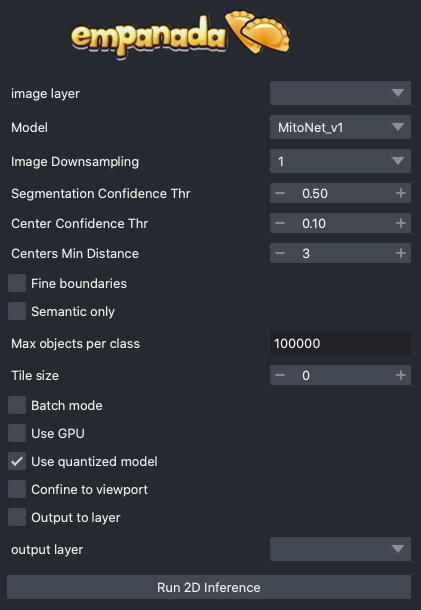
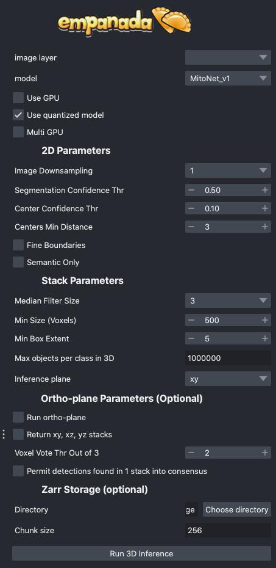

.. _modules:

Modules
---------

Overview
==========

Model Inference
^^^^^^^^^^^^^^^^^

`2D Inference (Parameter Testing)`_: Runs model inference on 2D images. Supports batch mode for
predicting segmentations on a series of unrelated images or can be used to segment arbitrary 2D slices
from volumetric data.

`3D Inference`_: Implements stack and ortho-plane inference functionality for volumetric datasets.

Model Training
^^^^^^^^^^^^^^^^^

`Pick training patches`_: Automatically picks patches of data to annotate from 2D or
3D images. Also gives the option for uses for manually select ROIs using placed points.

`Store training dataset`_: Stores training patch segmentations in the correct format
expected for model finetuning and training.

`Finetune a model`_: Allows users to finetune any registered model on a specialized
segmentation dataset.

`Train a model`_: Train models from scratch for arbitrary panoptic segmentation tasks.
Optionally, initialize training from CEM pre-trained weights for faster convergence
and greater robustness.

`Register new model`_: Make a new model accessible in all other training and inference
modules. Models can be registered from .pth files or from web URLs. Useful for
sharing models locally or over the internet.

`Get model info`_: Get information about registered models to help decide which one
is appropriate for inference or finetuning. 

Proofreading Tools
^^^^^^^^^^^^^^^^^^^^

`Merge and Delete labels`_: Allows the selection of multiple instances and merges them all to
the same label and allows the removal of selected labels, respectively.

`Split labels`_: Allows the placement of multiple markers for distance watershed-based instance splitting.

`Jump to label`_: Given a label ID, moves the napari viewer to the first 2D slice where an object appears.

2D Inference (Parameter Testing)
==================================

Results
^^^^^^^^^^^^^

Returns a 2D labels layer in the napari viewer or inserts a predicted
segmentation into a selected labels layer.

Parameters
^^^^^^^^^^^^^

**image layer:** The napari image layer on which to run model inference.

**Model:** Model to use for inference.

**Image Downsampling:** Downsampling factor to apply to the input image before running
model inference. The returned segmentation will be interpolated to the original
image size using the Point Rend module.

**Segmentation Confidence Thr:** The minimum confidence required for a pixel to
be classified as foreground. This only applies for binary segmentation.

**Center Confidence Thr:** The minimum intensity of a peak in the centers heatmap
for it to be considered a true object center.

**Centers Min Distance:** The minimum distance allowed between centers in pixels.

**Fine boundaries:** Whether to run Panoptic DeepLab postprocessing at 0.25x the
input image resolution. Can correct some segmentation errors at the cost of 4x
more GPU/CPU memory during postprocessing.

**Semantic Only:** Whether to skip panoptic postprocessing and return only a semantic
segmentation.

**Max objects per class:** The maximum number of objects that are allowed for any one
of the classes being segmented by the model.

**Batch Mode:** If checked, the selected model will be run independently on each
xy slice in a stack of images. This can be used, for example, to run inference on
all images in a folder by loading them with the "Open Folder..." option.

**Use GPU:** Whether to use system GPU for running inference. If no GPU is detected
on the workstation, then this parameter is ignored.

**Use quantized model:** Whether to use a quantized version of the segmentation model.
The quantized model only runs on CPU but uses ~4x less memory and runs 20-50% faster (depending
on the model architecture). Results may be 1-2% worse than using the non-quantized version.

**Output to layer:** If checked, the output of the model will be inserted into the given
output layer (next argument). This argument is incompatible with Batch mode and will raise
an error if both are checked.

**output layer:** If Output to layer is checked, the output of the model will be inserted
into this layer, otherwise a new layer will be created. The output layer must be the same
shape as the image layer.

See :ref:`plugin/best-practice:Inference Best Practices` below for more usage notes.

3D Inference
==================================

Results
^^^^^^^^^^^^^

Returns a 3D labels layer in the napari viewer for each segmentation class and,
optionally, panoptic segmentation stacks.

General Parameters
^^^^^^^^^^^^^^^^^^^^^^

**image layer:** The napari image layer on which to run model inference.

**model:** Model to use for inference.

**Zarr Directory (optional):** Path at which to store segmentation results in zarr
format. Writing results to disk can help avoid out-of-memory issues when running
inference on large volumes. Napari natively supports reading zarr files.

**Use GPU:** Whether to use system GPU for running inference. The box will be
check by default if a GPU is found on your system. If no GPU is detected, then
this parameter is ignored.

**Use quantized model:** Whether to use a quantized version of the segmentation model.
The quantized model only runs on CPU but uses ~4x less memory and runs 20-50% faster (depending
on the model architecture). Results may be 1-2% worse than using the non-quantized version.

**Multi GPU:** If the workstation is equipped with more than 1 GPU, inference
can be distributed across them. See note in :ref:`plugin/best-practice:Inference Best Practices`.

2D Parameters
^^^^^^^^^^^^^^^^

**Image Downsampling:** Downsampling factor to apply to the input image before running
model inference. The returned segmentation will be interpolated to the original
image size using the Point Rend module.

**Segmentation Confidence Thr:** The minimum confidence required for a pixel to
be classified as foreground. This only applies for binary segmentation.

**Center Confidence Thr:** The minimum intensity of a peak in the centers heatmap
for it to be considered a true object center.

**Centers Min Distance:** The minimum distance allowed between centers in pixels.

**Fine boundaries:** Whether to run Panoptic DeepLab postprocessing at 0.25x the
input image resolution. Can correct some segmentation errors at the cost of 4x
more GPU/CPU memory.

**Semantic Only:** Whether to skip panoptic postprocessing and return only a semantic
segmentation.

Stack Parameters
^^^^^^^^^^^^^^^^^^^

**Median Filter Size:** Number of image slices over which to apply a median filter
to semantic segmentation probabilities.

**Min Size (Voxels):** The smallest size object that's allowed in the final
segmentation as measured in voxels.

**Min Box Extent:** The minimum bounding box dimension that's allowed for an
object in the final segmentation. (Filters out big "pancakes").

**Max objects per class in 3D:** The maximum number of objects that are allowed for any one
of the classes being segmented by the model within a volume.

**Inference plane:** Plane from which to extract and segmentat slices. Choice of xy, xz, or yz.

Ortho-plane Parameters (Optional)
^^^^^^^^^^^^^^^^^^^^^^^^^^^^^^^^^^^^

**Run ortho-plane:** Whether to run ortho-plane inference. If unchecked, inference
will only be run on slices from the Inference plane chosen above.

**Return xy, xz, yz stacks:** Whether to return the panoptic segmentation stacks created
during inference on each plane. If unchecked, only the per-class consensus volumes
will be returned.

**Voxel Vote Thr Out of 3:** Number of stacks from ortho-plane inference in which a voxel
must be labeled in order to end up in the consensus segmentation.

**Permit detections found in 1 stack into consensus:** Whether to allow objects
that appear in only a single stack (for example an object only segmented in xy)
through to the ortho-plane consensus segmentation.

Pick training patches
==================================

.. image:: ../_static/pick_patches.png
  :align: center
  :width: 500px
  :alt: Dialog for the patch picking module.

Results
^^^^^^^^^^^^^

If the image to pick patches from is 3D, returns a set of flipbooks with five
images in each along with a corresponding labels layer of the same size. If the
image is instead 2D or a 2D stack, returns a set of patches and a labels layer
of matching size.

.. note::

  When flipbooks are returned, it's assumed that the middle image in each will
  be annotated. For example, in a flipbook with five images, only the third image
  should be segmented.

Parameters
^^^^^^^^^^^^^

**image layer:** The napari image layer from which to sample patches.

**points layer:** Optional. The napari points layer containing fiducial points
centered at ROIs to pick for annotation.

**Number of patches for annotation:** Number of patches to pick for annotation.
By default, patches are chosen randomly. If the points layer was given but has
fewer points than this number, the remainder will be made up with random patches.
Overwritten if **Pick all points** (below) is selected.

**Patch size in pixels:** The desired pixel size for chosen patches. All patches
are square.

**Multiscale image level:** If the image layer is a multiscale image, select the
resolution level from which to sample. It's assumed that images in each level
were downsampled by 2x.

**Pick all points:** If checked, patches will be created from all points in
the given points layer, regardless of the **Number of patches for annotation**
that was set.

**Pick from xy, xz, or yz:** If checked, patches will be arbitrarily selected from
any of the principle planes. Only select this option for nearly isotropic voxel
3D datasets.

**Image is 2D stack:** If checked, treats the image layer as a stack of unrelated
2D images. For example, check this box when picking patches from a directory
of 2D images that were loaded with the "Open Folder..." option.

Store training dataset
==================================

.. image:: ../_static/store_training_dataset.png
  :align: center
  :width: 500px
  :alt: Dialog for the dataset saving module.

Results
^^^^^^^^^^^^^

Creates or appends data to a directory with the structure expected for
model finetuning and training. If the image and labels layers are
flipbooks, only the middle image in each flipbook is saved.

Parameters
^^^^^^^^^^^^^

**image layer:** The napari image layer for annotated patches or flipbooks.

**labels layer:** The napari labels layer for annotated patches or flipbooks.

**Save directory:** Directory in which to save the dataset. A subdirectory
with the given **Dataset name** (below) will be created.

**Dataset name:** Name of the dataset directory to create. If the dataset already
exists, the new data will be appended.

Finetune a model
==================================

.. image:: ../_static/finetune_model.png
  :align: center
  :width: 500px
  :alt: Dialog for the model finetuning module.

Results
^^^^^^^^^^^^^

Saves and registers a .pth torchscript model that has been finetuned on
the provided data. Also saves a .yaml config with parameters necessary for
additional finetuning.

Parameters
^^^^^^^^^^^^^

**Model name, no spaces:** Name of the finetuned model as it will appear in the
other empanada modules after finetuning.

**Train directory:** Training directory for finetuning. Must conform to the
standard directory structure specified for empanada (as for example is created
by the `Store training dataset`_ module).

**Validation directory (optional):** Validation directory. Must conform to the
standard directory structure specified for empanada. Can be the same as **Train directory**.

**Model directory:** Directory in which to save the finetuned model definition
and config file. The directory will be created if it doesn't exist already.

**Model to finetune:** Empanada model to finetune.

**Finetunable layers:** Layers to unfreeze in the model encoder during
finetuning.

**Iterations:** Number of iterations to finetune the model.

**Patch size in pixels:** Patch size in pixels to use for random cropping of the image during finetuning.
Should be divisible by 16 for PanopticDeepLab model or 128 for PanopticBiFPN models. Use `Get model info`_ to
check.

**Custom config (optional):** Use a custom config file to set other training
hyperparameters. `See here for a finetuning template to modify <https://github.com/volume-em/empanada-napari/blob/main/custom_configs/custom_finetuning.yaml>`_.

Train a model
==================================

.. image:: ../_static/train_model.png
  :align: center
  :width: 500px
  :alt: Dialog for the model training module.

Results
^^^^^^^^^^^^^

Saves and registers a .pth torchscript model that has been trained on
the provided data. Also saves a .yaml config with parameters necessary for
additional finetuning.

Parameters
^^^^^^^^^^^^^

**Model name, no spaces:** Name of the model as it will appear in the
other empanada modules after training.

**Train directory:** Training directory for finetuning. Must conform to the
standard directory structure specified for empanada (as for example is created
by the `Store training dataset`_ module).

**Validation directory (optional):** Validation directory. Must conform to the
standard directory structure specified for empanada. Can be the same as **Train directory**.

**Model directory:** Directory in which to save the trained model definition,
weights, and config file. The directory will be created if it doesn't exist already.

**Dataset labels:** List of labels in the training dataset. Each line is a comma separated list of three
items without spaces: <class_id>,<class_name>,<class_type>. Class IDs must be integers, class names
can be anything, class types must be either 'semantic' or 'instance'.

**Label divisor:** For mutliclass segmentation, the label divisor that was used
to offset the labels for each class.

**Model architecture:** The model architecture to use for training.

**Use CEM pretrained weights:** If checked the model encoder will be initialized
with the latest CEM weights. (CEM weights are created by self-supervised training
on the very large and heterogeneous CEM dataset).

**Finetunable layers:** Layers to unfreeze in the model encoder during
training. Ignored if **Use CEM pretrained weights** isn't checked.

**Iterations:** Number of iterations to train the model.

**Patch size in pixels:** Patch size in pixels to use for random cropping of the image during finetuning.
Should be divisible by 16 for PanopticDeepLab model or 128 for PanopticBiFPN models.

**Custom config (optional):** Use a custom config file to set other model and training
hyperparameters. `See here for a training template to modify <https://github.com/volume-em/empanada-napari/blob/main/custom_configs/custom_training_pdl.yaml>`_.

**Description:** Free form text description of the model including details about the training data, model purpose,
and other relevant information. 

Register new model
====================

.. image:: ../_static/register_new_model.png
  :align: center
  :width: 500px
  :alt: Dialog for the register new model module.

Results
^^^^^^^^^^^^^

Adds a new model to choose in inference and training modules.

Parameters
^^^^^^^^^^^^^^^^

**Model name:** Name to use for this model throughout the other plugin modules.

**Model config file:** Config file for the model as created in the Finetuning and Training
modules or by exporting from the empanada library.

**Model file (optional):** Path or URL to the torchscript .pth file defining the model. If the path/url
given in the config file is correct this is unnecessary.

**Quantized model file (optional):** Path or URL to the quantized torchscript .pth file defining the model.
If the path/url given in the config file is correct this is unnecessary.

.. note::

  If the 2D or 3D Inference module have already been opened, then registered models may not
  appear in the available models list. Open and close the relevant module or restart napari.

.. note::

  Removing models is manual. Simply delete or move the config file from `~/.empanada/configs`.

Get model info
====================

.. image:: ../_static/get_info.png
  :align: center
  :width: 500px
  :alt: Dialog for the get info module.

Results
^^^^^^^^^^^^^

Prints information about the model to the terminal.

Parameters
^^^^^^^^^^^^^^^^

**Model name:** Name of the model to get information about. 
  
Merge and Delete labels
=============================

.. image:: ../_static/merge_labels.png
  :align: center
  :width: 500px
  :alt: Dialog for the merge and delete labels module.

Results
^^^^^^^^^^^^^

In-place merges or deletes selected labels from a labels layer.

Parameters
^^^^^^^^^^^^^^^^

The parameters for the Merge and Delete labels modules are the same.

**labels layer:** The napari labels layer for which to apply operations.

**points layers:** The napari points layer used to select instances for merging/deletion.

Split labels
=============================

.. image:: ../_static/split_labels.png
  :align: center
  :width: 500px
  :alt: Dialog for the split labels module.

Results
^^^^^^^^^^^^^

In-place splits the selected label in the labels layer.

Parameters
^^^^^^^^^^^^^^^^
.. note::

  Only one instance can be split at a time. All points aside from the first one will
  be ignored and deleted unless **Use points as markers** (below) is checked.

**labels layer:** The napari labels layer for which to apply operations.

**points layers:** The napari points layer used to select instance for splitting.

**Minimum Distance:** Minimum distance from the boundary of the instance for
a pixel/voxel to be included in a watershed marker.

**Use points as markers:** If checked, minimum distance will be ignored and the
watershed transform will treat each point as a marker.

Jump to label
=============================

.. image:: ../_static/jump_label.png
  :align: center
  :width: 500px
  :alt: Dialog for the jump to label module.

Results
^^^^^^^^^^^^^

Moves the napari viewer to the first slice showing the given label ID, if found.

Parameters
^^^^^^^^^^^^^^^^

**labels layer:** The napari labels layer in which to find the label.

**Label ID:** Integer ID for the label to jump the viewer to.
