.. _tutorials:

Tutorials
------------

Inference on 2D images
^^^^^^^^^^^^^^^^^^^^^^^^

To get started, `download some example TEM images <https://www.dropbox.com/s/t9z8v2j06ttlhng/empanada_tem.zip?dl=0>`_.

If you installed napari into a virtual environment as suggested in :ref:`plugin/install:Installation`, be sure to activate it::

    $ conda activate empanada

Launch napari::

    $ napari

Loading Directory of Images
""""""""""""""""""""""""""""""

After unzipping the downloaded data, choose "File > Open Folder", navigate to the empanada_tem directory,
and click "Open":

|pic1| |pic2|

.. |pic1| image:: ../_static/open_folder.png
   :width: 45%

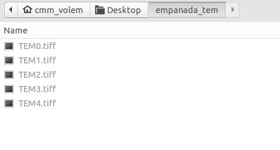

Tuning downsampling
""""""""""""""""""""""

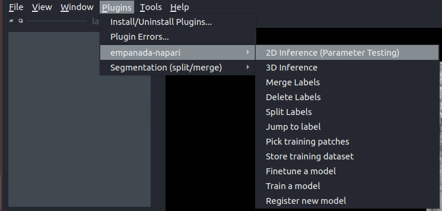

Navigate to the plugin menu and select "2D Inference (Parameter Testing)":

Descriptions of all parameters are explained in :ref:`plugin/modules:2D Inference (Parameter Testing)`. The most
important parameter to tune is the **Image downsampling**. To start with, try the
**MitoNet_v1** model without downsampling, with 2x downsampling, and with 4x downsampling. Results
should look something like this (click the image for high-res):

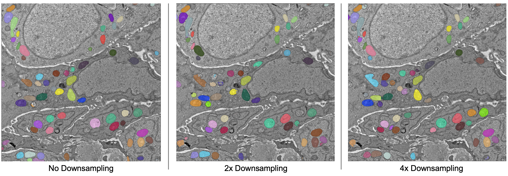

The results are best without any downsampling but are still quite good even with 4x downsampling. As a rule, too
much downsampling will result in more false positive detections and more false negatives
for small objects in particular. Boundaries between closely packed objects will also be less well-defined.

As a counterpoint look at the effect of downsampling on the second image in the stack:

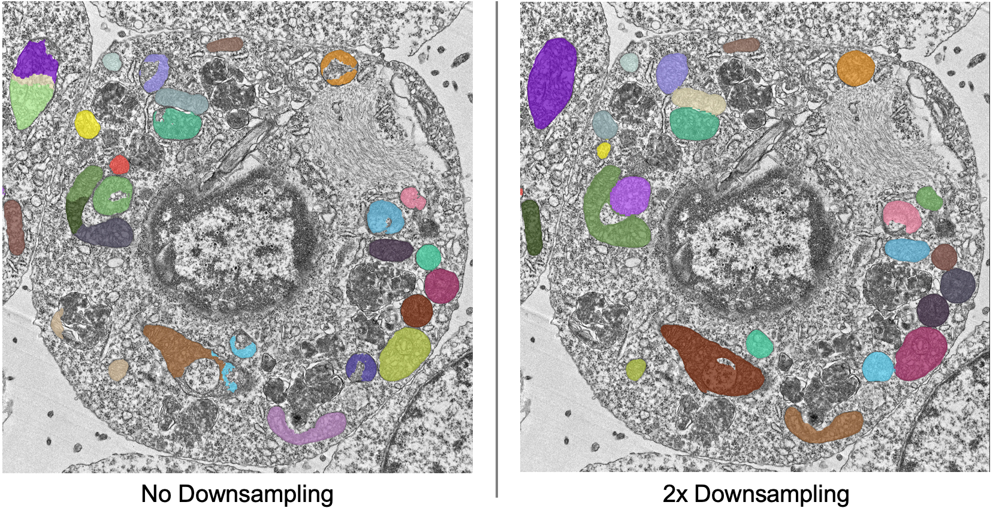

Here downsampling by a factor of 2 significantly reduces oversplitting errors and results in a better
pixel-level segmentation. Plus, the smaller image size means that model inference will
be faster and use less memory! The takeaway is that it's important to test different downsampling
factors on new datasets to see which is best. Always opt to use the largest downsampling factor
that gives satisfactory results.

Choosing the right model
"""""""""""""""""""""""""""

By default, empanada-napari ships with two versions of the MitoNet model: **MitoNet_v1** and
**MitoNet_v1_mini**. As the name implies, **MitoNet_v1_mini** is a more compact version of
the full model. With ~30 million fewer parameters it runs 50-70% faster on GPU. Semantic
segmentation quality is almost equally good (sometimes better) but it's ability to
resolve individual instances isn't quite as strong. Here are results on the first
image of the stack with 2x downsampling; arguably the mini model yields a slightly
better segmentation.

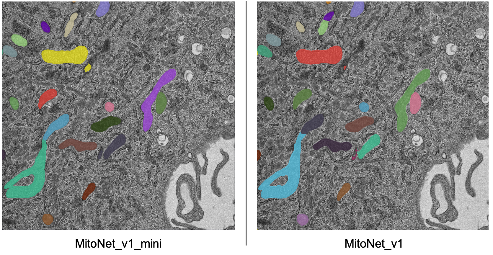

Using Batch Mode
"""""""""""""""""""""""""""

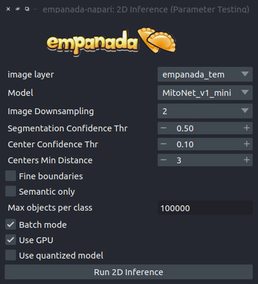

Batch mode lets you run inference with a given configuration on all images in the
stack. Running with the options shown on left will create 5 segmentation layers (i.e.,
one for each image).

Proofreading in 2D
"""""""""""""""""""""

To correct mistakes, use the proofreading tools to paint, erase, merge, split, and delete labels.

Let's look at the second image in the stack. First, select the correct labels layer in the lower left hand panel
(**b**). Next, select the dropper tool, denoted by the green arrow in panel **a**, and click on the label you'd like to edit. 
Paint and erase tools are denoted by the blue and red arrows in **a**, respectively. Simply click and drag to make corrections.

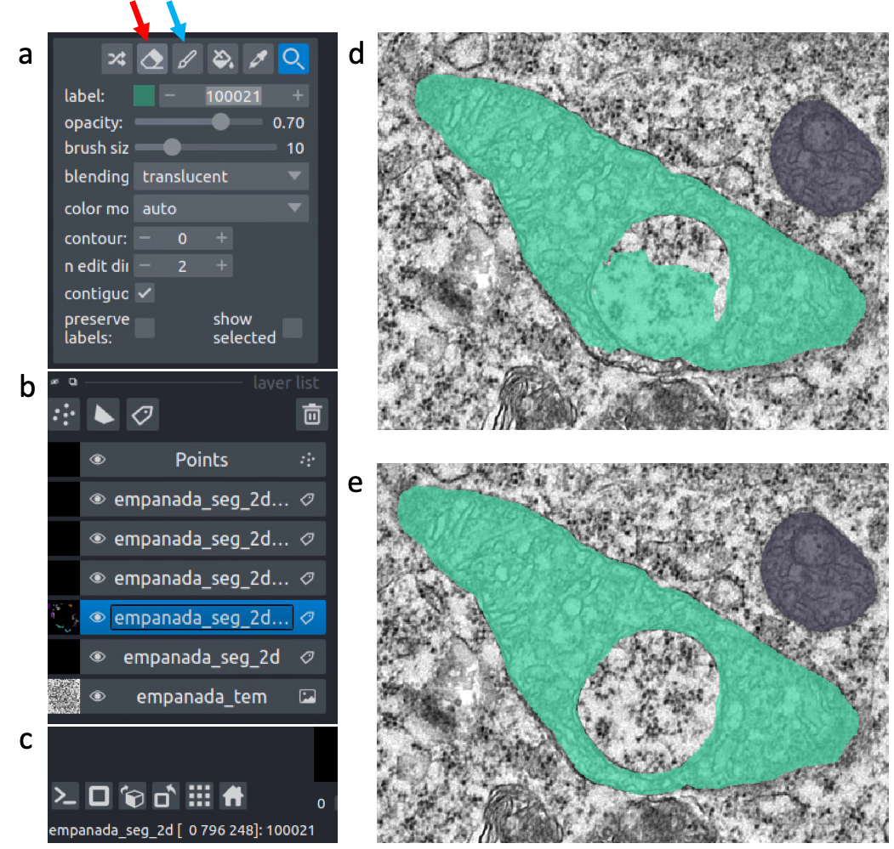

To run merge, split, and delete operations, create a new points layer (red arrow in panel **b** below).
Place points by clicking the circle with a plus sign (panel **a**) and clicking in the viewer window.
The model output is shown in the top left corner of the figure below. After placing points on the
yellow and purple labels, click the **Merge labels** button. Make sure that the labels layer matches
the layer you're working on (seen panel **b** in the previous figure), if not you'll get an "out-of-bounds"
error. Also, always leave the Apply 3D button unchecked when proofreading in 2D.

This overmerges the two instances. To split them, place a single point anywhere on the yellow label and
click the **Split labels** button (again making sure the labels layer selected is correct). Adjusting the
Minimum distance slider will control how many fragments the label gets split into.

Repeat the merge operation by placing the four dots shown in the top right of the figure.

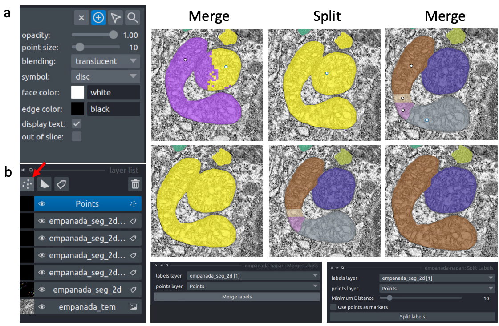

Exporting 2D
""""""""""""""

.. note::

  The process for exporting 2D labels for a stack is not stable. Only proceed through
  the following section when 100% finished with all manually cleanups.

The last step is to export the segmentations. Currently, this requires a work around if
you'd like to open the segmentations in software other than napari. This is a high-priority
pain point that we intend to fix. Open the napari console (red arrow):

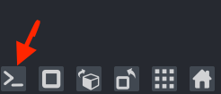

Paste the following code and press enter::

    import numpy as np
    for layer in viewer.layers:
        if type(layer) == napari.layers.Labels:
            layer.data = layer.data.astype(np.uint32).squeeze()

Select all the layers to export and save them to a new folder:

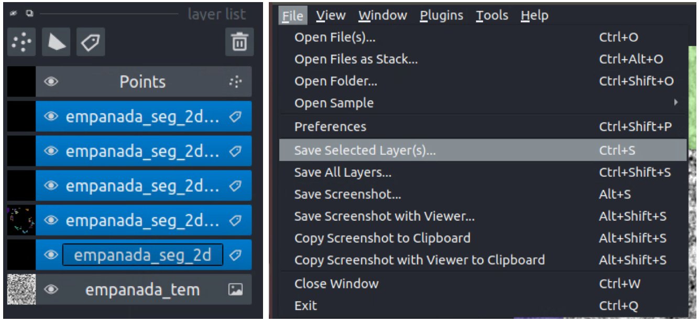

Inference on volumetric data
^^^^^^^^^^^^^^^^^^^^^^^^^^^^^^^

To get started, `download an example HeLa cell FIBSEM dataset <https://www.dropbox.com/s/2gu3go2puzc47ip/hela_cell_em.tif?dl=0>`_.

If you installed napari into a virtual environment as suggested in :ref:`plugin/install:Installation`, be sure to activate it::

    $ conda activate empanada

Launch napari::

    $ napari

Loading HeLa Cell Data
""""""""""""""""""""""""""

Drag and drop the hela_cell_em.tif file into the napari window.

Parameter Testing
"""""""""""""""""""

Before running 3D inference, which may take a considerable amount of time for large volumes,
using the :ref:`plugin/modules:2D Inference (Parameter Testing)` for parameter testing. For more details see `Tuning downsampling`_ and
`Choosing the right model`_. In depth descriptions of how the other parameters affect model
output are provided in :ref:`plugin/best-practice:Inference Best Practices`.

It's important to test the model on all three principle planes: xy, xz, and yz in order to check
if ortho-plane inference or stack inference on a particular plane would be better. Click the
transpose button (red arrow below) to view and test models on different planes.

By default, xy planes are shown. One click of transpose will show yz planes, two clicks
will show xz planes and three clicks will bring it back to xy planes. After each transpose,
run the 2D Inference module and inspect results:

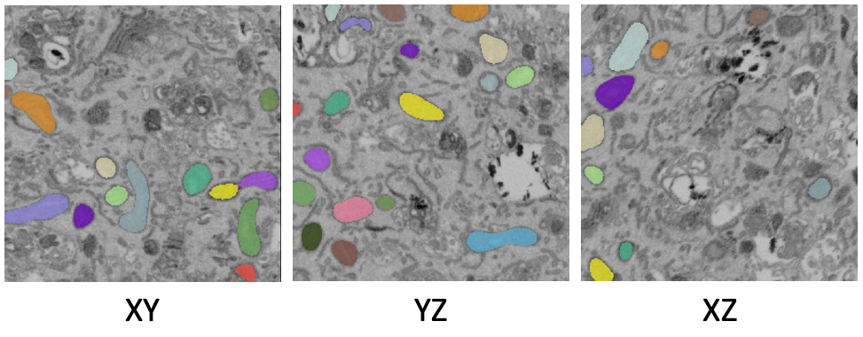

Here, the results are equally good on all three planes and the voxels are clearly
isotropic. That means this dataset is a good candidate for ortho-plane inference.

Running 3D Inference
""""""""""""""""""""""

All parameters and best practices for setting them are detailed in :ref:`plugin/modules:3D Inference`
and :ref:`plugin/best-practice:Inference Best Practices`, respectively. We'll run ortho-plane inference
with the parameters shown below.

.. image:: ../_static/ortho_params.png
  :align: center
  :width: 600px

.. note::

  For large datasets, it's recommended to start by running 3D inference on a small
  ROI of 256x256x256 or similar. Tweak parameters to get satisfactory results on
  this ROI before applying to the larger dataset.

  The consensus algorithm used to merge the xy, yz, and xz segmentation stacks
  can struggle when challenged with very closely packed together objects.
  If results look satisfactory with stack inference on the chosen ROI, then
  it's recommended to avoid ortho-plane inference. Checking the box to
  "Return xy, xz, and yz stacks" gives you the option to choose between any of
  the stacks or ortho-plane results without re-running inference. Note, however, that
  the stack inference results do NOT have small object filtering applied so may
  show more false positives than if they were generated outside of the ortho-plane
  inference workflow.

Visualizing the results
"""""""""""""""""""""""""

Results can be visualized in 3D by toggling the 3D viewer (red arrow).
Turn on and off the stack inference results and compare them to ortho-plane results.

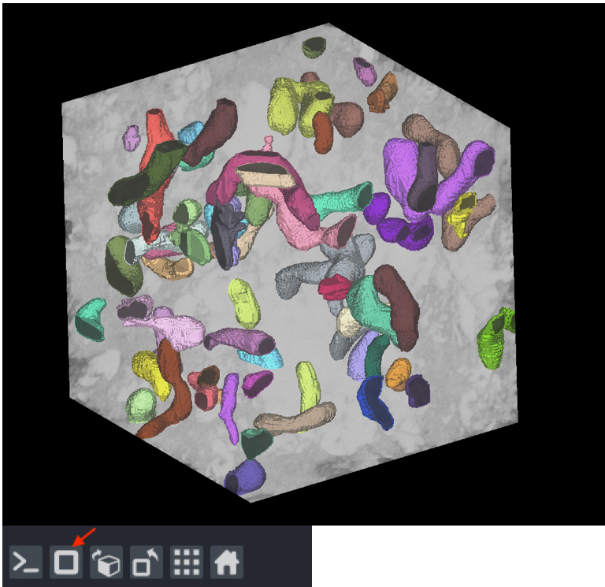

Proofreading in 3D
"""""""""""""""""""""""""

The proofreading operations for 3D data work identically to those for `Proofreading in 2D`_. 
Simply check the "Apply in 3D" option to merge, split, and delete labels throughout the entire volume.

.. note::

  If you chose to save the segmentations as zarr the split proofreading function
  will not work. We plan to address this gap in the future.

Exporting 3D
""""""""""""""

To save, simply select one or more layers and "Save selected layers":

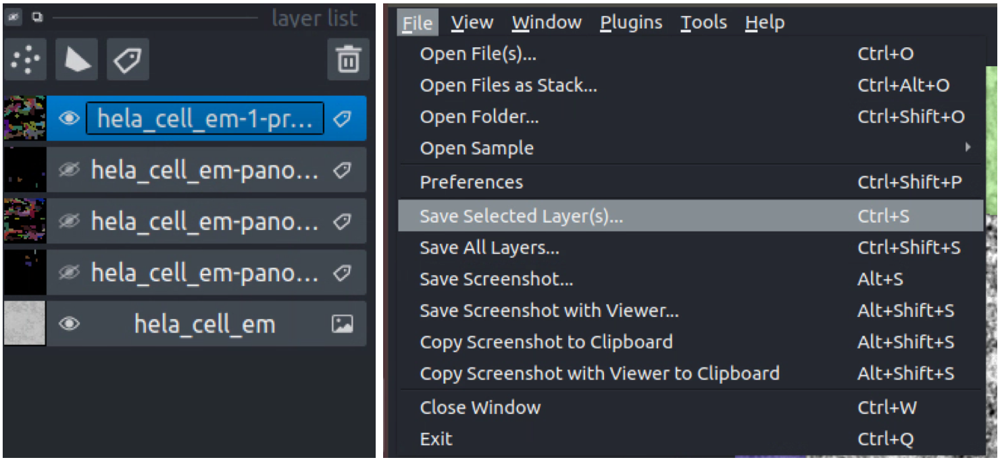

.. note::

  If you chose to save the segmentations as zarr, there's no need to export
  them – they're already saved in the directory you picked.

Finetuning an existing model
^^^^^^^^^^^^^^^^^^^^^^^^^^^^^^^^

To get started, `download an example C. Elegans FIBSEM dataset <https://www.dropbox.com/s/hm8xg8n4raio99q/c_elegans_em.tif?dl=0>`_
and `some instance annotations <https://www.dropbox.com/s/qd8872r6cumbya2/c_elegans_mitos.zip?dl=0>`_. Unzip the annotations.

If you installed napari into a virtual environment as suggested in :ref:`plugin/install:Installation`, be sure to activate it::

    $ conda activate empanada

Launch napari::

    $ napari

Loading C. Elegans Data
""""""""""""""""""""""""""

Drag and drop the c_elegans_em.tif file into the napari window.

Choosing a model
""""""""""""""""""""""""

First, decide which model to finetune by using the :ref:`plugin/modules:Get model info` module, selecting a model from
the dropdown list, and clicking the "Print info to terminal" button. For this tutorial let's have
a look at the MitoNet_v1_mini model:

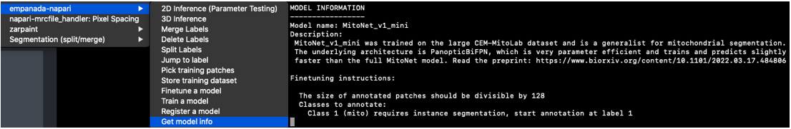

Looking at the finetuning instructions tells us that this model expects image patches
that are divisible by 128 and that it segments a single instance class: mitochondria.
It also tells us that we should start annotation with label 1 for the first mitochondrion
and increment by 1 for each subsequent mitochondrion.

Picking training data
""""""""""""""""""""""""

Open the :ref:`plugin/modules:Pick training patches` and :ref:`plugin/modules:Store training dataset` modules (green arrows). It's possible
to pick patches randomly from the entire volume or from a particular ROI by placing points. For example,
let's place 2 points on areas that we think may be difficult to segment. First, create a points layer 
(red arrow bottom left), switch to point add mode (blue circle with + sign in middle left), and then
click to place points in the viewer. Now, we'll use the Pick training patches module to pick
16 patches of size 256x256, because this data has isotropic voxels we'll also check the "Pick from
xy, xz, or yz" box. The first 2 patches selected will be from the points that we placed, the other
14 patches will be randomly picked from the volume.

For 3D datasets, the patches are output as flipbooks (short stacks of 5 images). Only the middle (third image)
in each flipbook should be annotated, the other images are there to provide some 3D context. At the bottom of the
viewer you'll see that there are two sliders. The top one scrolls through the stack of images and the bottom one 
scrolls through the flipbooks. Make sure all annotations are made on slice "2" of the top slider (bottom right panel).

See the next section for how to annotate flipbooks. Once all images have been annotated, select the appropriate flipbook 
image and corresponding labels layer then click the "Save flipbooks" button (middle right panel).

.. note::

  Finetuning requires at least 16 training patches to be annotated. They can be completed in batches though,
  the Store training dataset module will append them to an existing dataset if the directory and dataset name
  match.

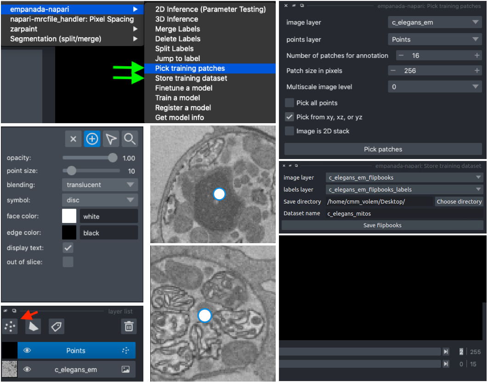

Annotating training data
""""""""""""""""""""""""""

To avoid confusion it's best to hide any layers other than the flipbook image and labels layer.

It's possible to use an existing model to get initial segmentation for cleanup. To do this,
open the :ref:`plugin/modules:2D Inference (Parameter Testing)` module, check the "Output to layer" box, and
select the flipbook labels layer "c_elegans_em_flipbooks_labels". Make sure you're on the third slice
of a flipbook and click "Run 2D Inference". This will insert the segmentation into the labels layer.
You can then paint and erase labels following `Proofreading in 2D`_. HOWEVER, merge, split, and delete
proofreading tools cannot be used because all flipbook segmentations are stored in the same labels
layer! (We'll investigate ways to remove this restriction in the future. One work around is to pick
one patch at a time for annotation, store it, and repeat until you reach 16).

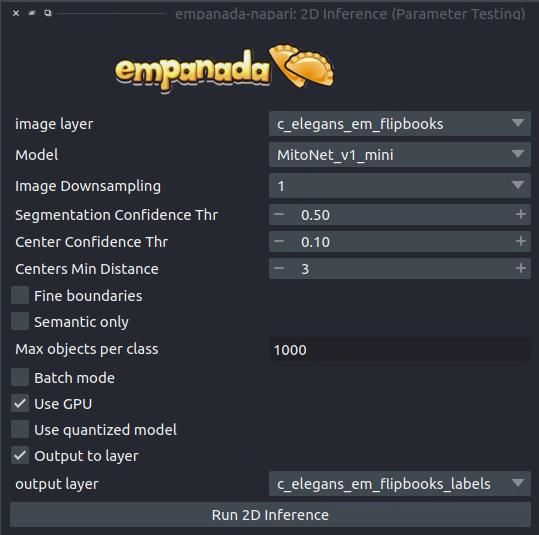

.. note::

  If you use the settings shown in the figure above, you'll notice that the segmentation labels
  start at 1001. This is OK when the model only has one instance class, but if you have multiple classes
  then you'll have to make sure that the "Max objects per class" field is equal to the label divisor printed
  from :ref:`plugin/modules:Get model info`. The relevant line says, "Use a label divisor of {label_divisor}". The default label divisor
  for models trained in empanada is 1000. Anytime the label divisor is "None" you don't have to worry about which labels
  you use so long as they're unique for each instance.

Finetuning the model
"""""""""""""""""""""""""

Using the annotations that you downloaded, finetuning a model is simple. We'll use the same annotations
for training and validation, though you could easily create a separate validation set if desired. Setting the
"Finetubale layers" to "all" means that all encoder layers will be finetuned. This generally gives better
results, but training with fewer finetunable layers will require less memory and time. 100 training iterations
is a good starting point, but increasing the number of iterations may yield better results. For a fairly general
model like MitoNet, training for more than 500 iterations shouldn't be necessary unless you've annotated a lot
of images.

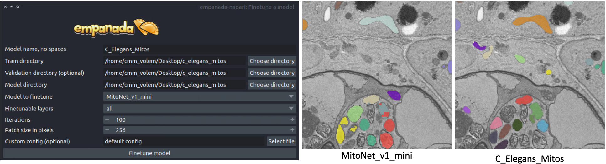

Once finetuning finishes, the model will appear in dropdowns across all other modules in the plugin. If it
doesn't, close the module and reopen it. Unsurprisingly, we see that a finetuned model works much better on 
this data than vanilla MitoNet. See `Inference on 2D images`_ and `Inference on volumetric data`_  
for details on how to use the model for inference. 

Training a panoptic segmentation model
^^^^^^^^^^^^^^^^^^^^^^^^^^^^^^^^^^^^^^^^^

To get started, `download an example mouse liver FIBSEM dataset <https://www.dropbox.com/s/za9q1h2yancx1ow/openorganelle_mouse_liver_roi.tif?dl=0>`_
and `some panoptic annotations <https://www.dropbox.com/s/c4veu311mvk8ujx/mouse_liver_er_mito_nuclei.zip?dl=0>`_. Unzip the annotations.

If you installed napari into a virtual environment as suggested in :ref:`plugin/install:Installation`, be sure to activate it::

    $ conda activate empanada

Launch napari::

    $ napari

Loading Liver Data
""""""""""""""""""""

Drag and drop the openorganelle_mouse_liver_roi.tif file into the napari window.

Picking panoptic data
""""""""""""""""""""""""

See `Picking training data`_ in the `Finetuning an existing model`_ tutorial. The same instructions apply.

Annotating panoptic data
""""""""""""""""""""""""""

See `Annotating training data` in the `Finetuning an existing model`_ tutorial to get started.
The key difference between annotation for instance and panoptic segmentation is the use of a label divisor.
The label divisor separates semantic and instance classes and allows for multiple objects to be segmented
for each instance class. 

For this tutorial, we're interested in segmenting ER (semantic), mitochondria (instance), and nucleus (semantic). 
The only requirement for the label divisor is that it is greater than the number of mitochondrial instances in any given patch.
To be very comfortable let's use a label divisor of 1,000, though 100 would be fine as well. Remember what you choose,
you'll need it later when training.

First, we'll label ER. Set the label to 1001 and paint all the ER:

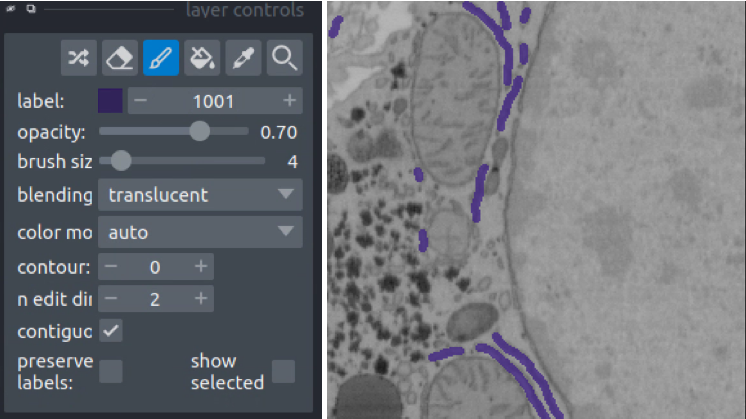

Second, we'll paint each mitchondrial instance. Set the label to 2001 and paint the first mitochondrion, then
increase the label to 2002 and paint the second mitochondrion.

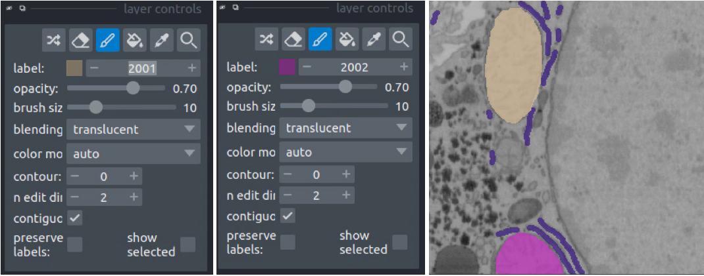

Finally, we'll paint the nucleus. Set the label to 3001 and paint all the nuclei.

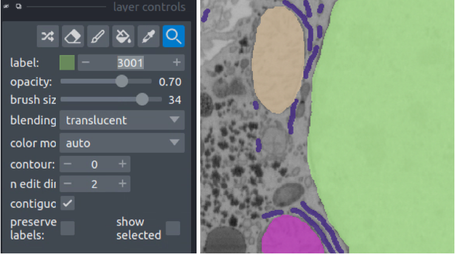

Once all annotations are completed use the :ref:`plugin/modules:Store training dataset` module to save them to a directory.

Training the model
""""""""""""""""""""

Open the :ref:`plugin/modules:Train a model` module and fill in the train, validation, and model directory fields.
For the "Dataset labels" field, each line corresponds to a unique segmentation class. In this case,
the first segmentation class is ER, so the first line should be "1,er,semantic" (the order is class label,
class name, segmentation type). Class label should always be an integer, the class name can be any string,
and the segmentation type must be either "semantic" or "instance". The second and third lines are then 
"2,mito,instance" and "3,nucleus,semantic", respectively. For the training data provided the label divisor is 1000.

While using CEM pretrained weights will significantly reduce the amount of time required to train a robust
and performant model, multiclass segmentation classes typically need to train for a longer time. For this
case 500 iterations may be enough, but 1,000 might be better. You should never need to train for more than
10,000 iterations.

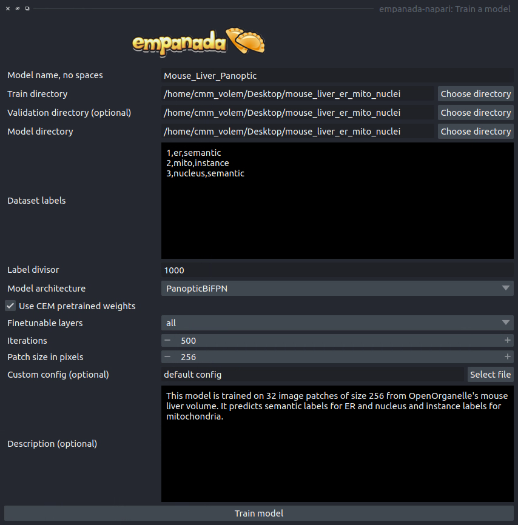

Once training finishes, the model will appear in dropdowns across all other modules in the plugin. If it
doesn't, close the module and reopen it. Here's the result:

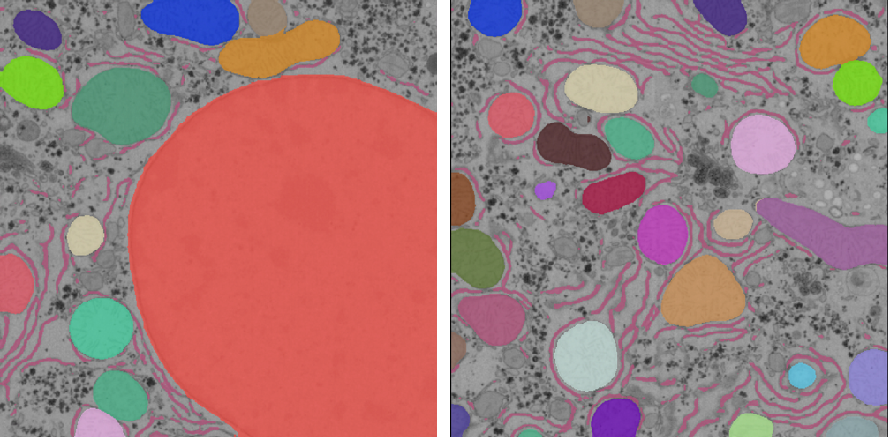

See the `Inference on 2D images`_ and `Inference on volumetric data`_  for details on how to use the model for inference. 