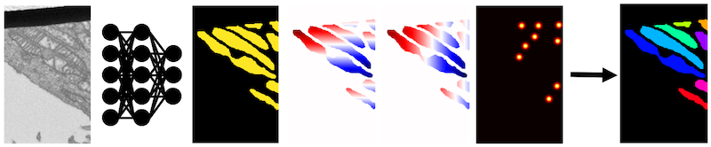

Models
----------

Empanada currently implements two panoptic segmentation models: Panoptic DeepLab and Panoptic BiFPN.
Optionally, both of these models have support for the PointRend module. Currently, all models that will be
deployed to empanada-napari require the PointRend module.

These models accept a grayscale EM image and output a semantic segmentation, up-down and right-left offsets, and a
heatmap with peaks at object centers. After postprocessing, a panoptic (or in the case below, instance) segmentation
is created.

    EM image (left) passes through the model and outputs, in order,
    a semantic segmentation, up-down and left-right offsets, centers heatmap.
    The panoptic (or instance) segmentation is created via postprocessing.

To create a model with a standard ResNet50 backbone::

	import empanada.models as em
	model = em.PanopticDeepLabPR(encoder='resnet50')
